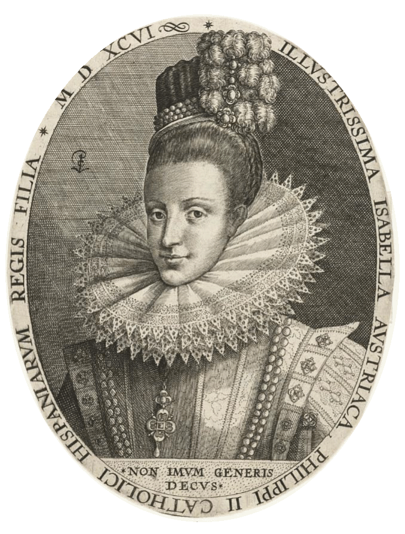
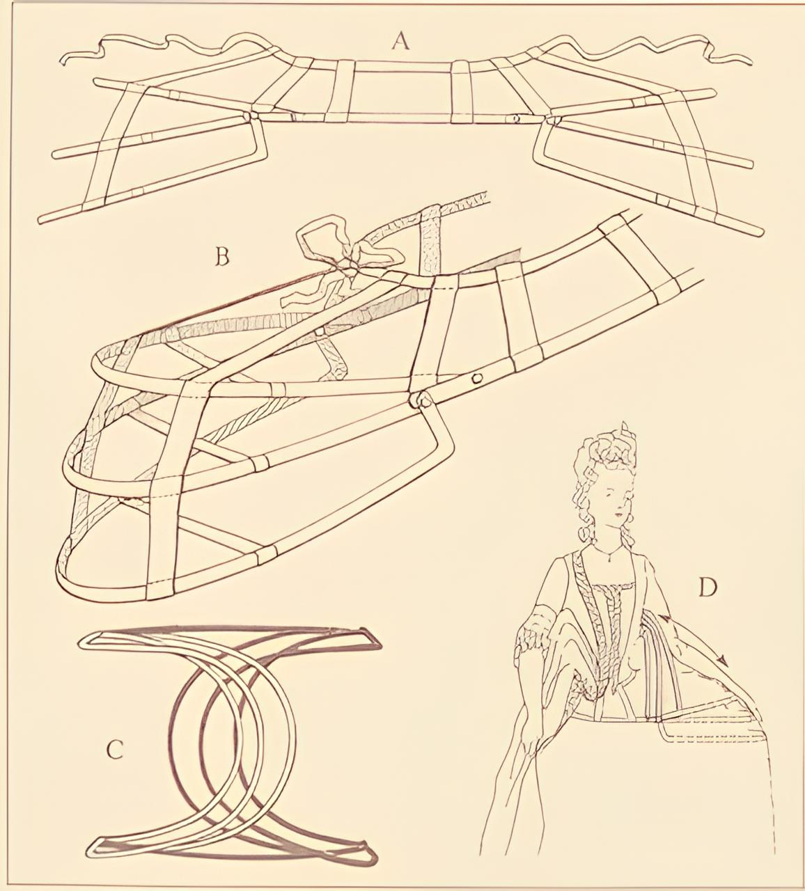
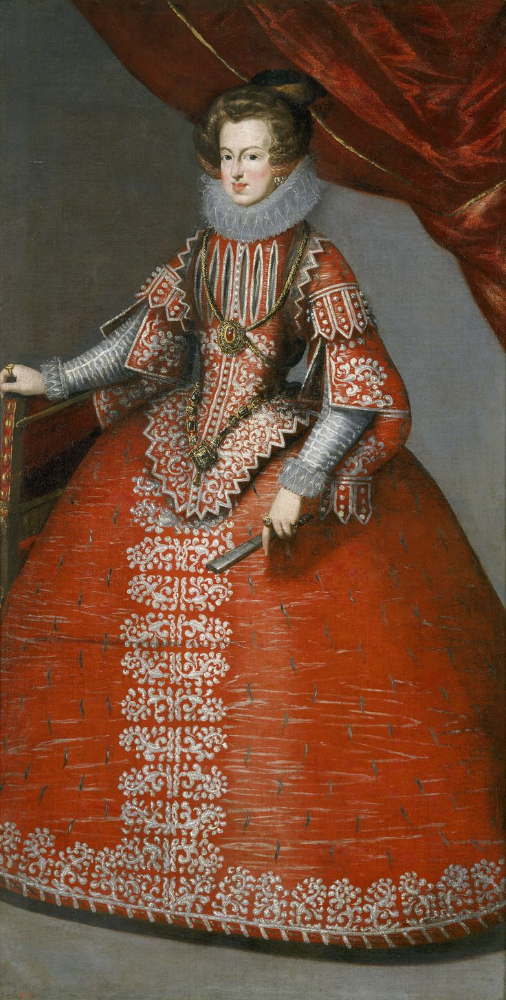
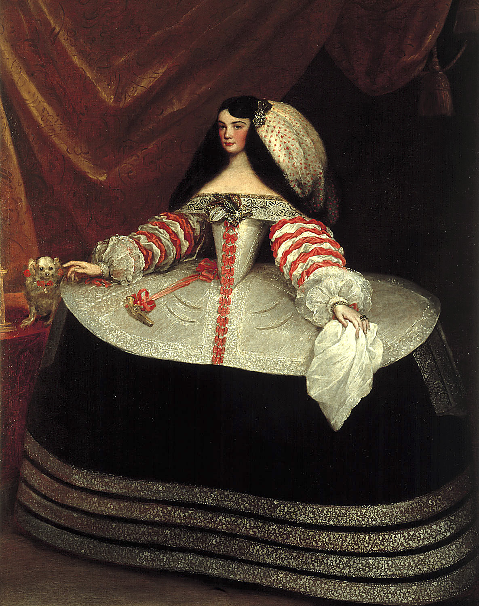
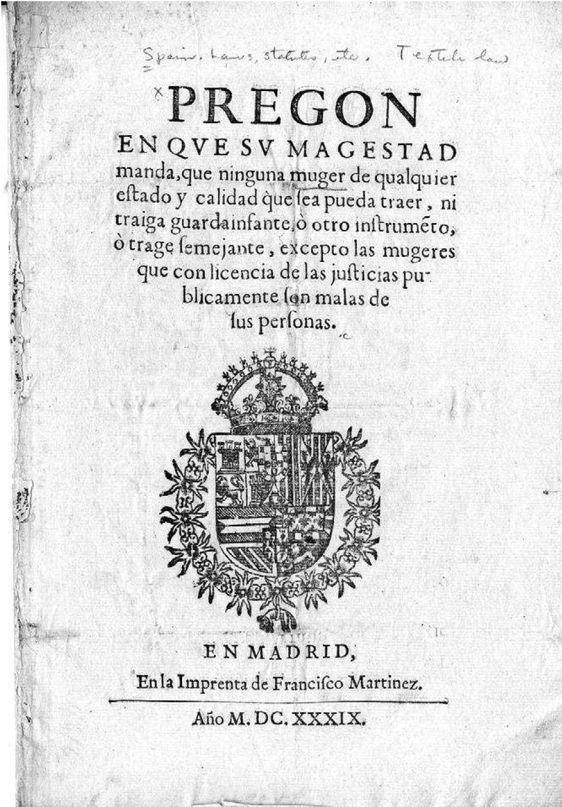
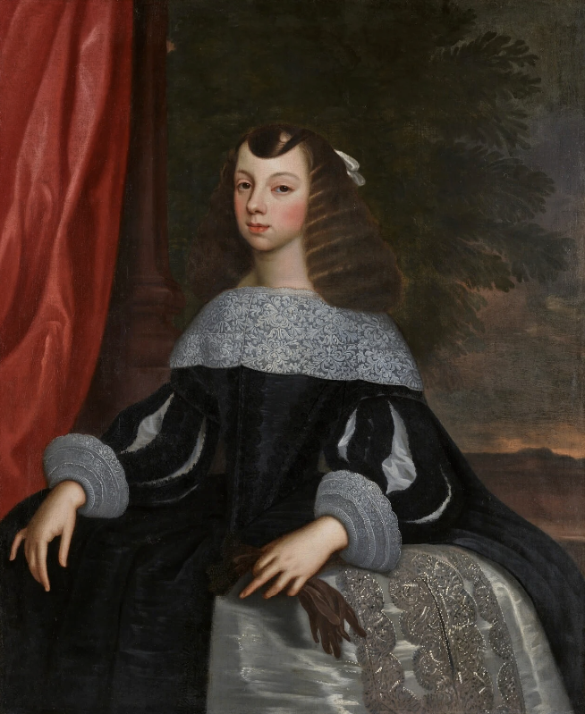

# Modisches Powerplay 
## Feminismus und Nationalismus

---

Diese Datenvisualisierung handelt von Isabel de Borbon, ihrem Kleid und der spanischen Krone.
Wir betrachten das Thema zeitgenössische und hinterfragen die Quellen.

---

## Machtfestigung 

Das Gemälde entstand 1620 und damit ein Jahr bevor Isabel de Borbon zur Königin von Spanien gekrönt wurde.
Zum Zeitpunkt der Entstehung ist sie Frau von Philip dem Vierten, dessen Bruder 1621 stirbt und damit die beiden zu Nachfolgern macht.

Gemalt von Rodrigo de Villandrando

circa 1620

Maße: 201 cm x 115 cm

heute hängt es im Museo del Prado

---

## Entstehung des Bildes

### Rodrigo de Villandrando
geboren in Madrid 1588
gestorben in Madrid 1622

Titel des ,,Gerichtsvollzieher”

Er war Maler des Spanischen Hofs von 1608 bis 1622.

---

## Die Mode en detail

Die Mode der Zeit ist starker Bedeutung für Macht, Familiäre Allianzen, Wohlstand und Geopolitischer Positionierung.

---

## Halskrause
Isabel de Borbon trägt eine Halskrause aus Spitze mit Floralen Details

Krausen aus Spitze wurden 1623 verboten, durch ein Luxusgesetz. Darauf folgten die Golilla Kragen, gehärtete Kragen die mehrmals getragen werden konnten.

Isabel Clara Eugenia
Juan Pantoja de la Cruz
(1553–1608)

 Juan Pantoja de la Cruz (Spanish, 1553-1608). Doña Ana de Velasco y Girón, 1603. Collection of Alicia Koplowitz

Busteportret van Isabella Clara Eugenia, Crispijn van de Passe (I), 1596
gravure, h 147mm × b 114mm

JUAN PANTOJA DE LA CRUZ (C. 1553-1608)
Margaret of Austria, Queen Consort of Philip III of Spain (1584-1611) c.1605
Oil on canvas | 204.6 x 121.2 cm | RCIN 404970

---

## Taschentuch und Manschette

### Manschette

Die Manschette war und ist häufig eine Art Gegenstück zum Kragen. Sie ergänzen sich oft in Stil und Form oder stehen in einem gewissen Verhältnis zueinander.

manchette ‚Ärmelchen'

### Spitze

Spitze >Garngeflecht< bzw.
>in Zacken auslaufende Borte<
Diese Spitzenform wurde zuerst in Venedig gepflegt (Point de Venise) und bald in Frankreich nachgeahmt (Point de France, Point de Neige, Rose Point)

---

# Women’s Fashions and Politics in Seventeenth-Century Spain: The Rise and Fall of the Guardainfante
Author: Amanda Wunder

---

# Guardainfanta
Die größte Machtdemonstration nach außen ist das Kleid von Isabel de Borbòn
Es handelt sich um ein sogenanntes Guardainfanta.

---

# Farbe
Die Farben des Kleids sind von äußerst großer Bedeutung. Es sind die klassichen Farben des Portugisischen Hofs.
Denn Isabel de Borbòn ist zum Zeitpunkt der Entstehung noch nicht Königin von Portugal, wird es aber bald werden.
Portugal ist zu diesem Zeitpunkt Teil der Spanischen Krone

---

# Die Konstruktion
Die Guardainfanta beruht auf dem Reifrock, genannt Farthingale. 
Der Reifrock wird aus Holz, Walknochen, später auch Blech an der Hüfte der Trägerin befestigt.
Darüber kommt meist ein Unterrock und dann die Guardainfanta.

Speziell an der Spansiche Variation des Fartingales ist die ovale Form. 
Die Fartingales von Frankreich und England waren meist rund.

Isabel de Borbón, 17. Jahrhundert

### Tontillo
Eine besonders breite Variante war in Mode von 1660 bis 1700

Juan Carreño de Miranda. Doña Inés de Zúñiga, Condesa de Monterrey.
Hacia 1660-1670. Museo Lázaro Galdiano. Madrid.

---

# Kritik an der Mode

María de la Encarnacion muss vor Gericht

Guardainfante seien zu groß, zu unbequem

Verheiratete Frauen sollten sich für ihren
Mann kleiden, damit er der Frau treu bleibt

Guardainfante würden zu viel Aufmerksamkeit
erzeugen in den Straßen

---

# Aufruhr in Madrid

Junge Männer zogen durch Madrid und beleidigten Frauen, die einen Guardainfante trugen.
Sie wurden Übergriffig und Gewaltsam gegenüber Frauen

### „Frauen würden Öffentliche Unruhe verursachen wenn sie so breit rumlaufen”

### “Now women do not fit in the world”
Ibid., 148 (line 60): “ya no caben las hembras dentro del mundo.”

According to those sixteenthcentury
authors, the ideal woman was silent and agreeable. She worked hard inside
the home to fulfill her domestic chores, and she avoided going out in public
whenever possible. She dressed cleanly but modestly and shunned cosmetics and
opulent attire, although a married woman might have to make up her face and
dress more lavishly if this was what her husband wanted.
39
Vives, 94–109; Le on, 302–28.

---

# Zwei Männer werden ermordet für ihr Verhalten gegenüber Frauen
## 1636 in Madrid

---

# Verbote

King Philip IV. Sumptuary law banning the guardainfante for all women
except for prostitutes. Madrid, 1639. Historical and Special Collections,
Harvard Law School Library.

Die neuen Gesetze suggestieren, es sei unmöglich die
Frauen vom Tragen des Guardainfante zu stoppen

Kleider wurden an der Fassade des Hof-Gefängnisses
aufgehangen.

Doch niemand beachtete das Gesetz, nicht einmal die
König Isabel de Borbón selbst

---

# Sexwork
Das neue Gesetz erlaubt nur Sexworkerinnen
den Guardainfante zu tragen.

Damit würden sie erkennbar sein und die
Öffentlichkeit könne ihr treiben überwache.
Da jeder Hausbesuch auffällig ist.

Klare Abgrenzung von der Gesellschaft und
Stigmatisierung von Sexworkenden

---

# Schwangerschaft

## „Frauen verstecken ihre Schwangerschaft”

Kein einziger Fall ist bekannt, von einer versteckten
Schwangerschaft unter dem Kleid.

Frauen wird vorgeworfen uneheliche Kinder zu verstecken.

Das Kleid sei demnach unehrlich und gefährlich

---

# Nationalismus
Katharina von Braganza heiratet in die britische Krone. Auf dem Weg zur Hochzeit steigt sie auf ein Schiff der Spanischen Krone in einer Guardainfanta und steigt einige Tage später von Bord wieder in einer Guardainfanta. Die britische Öffentlichkeit ist empört. Diese Zuschaustellung spanischer Herkunft, Katholischen Glaubens und Allianz zur Spanischen Krone lässt sie in Ungnade 

Catherine of Braganza
by or after Dirck Stoop
oil on canvas, circa 1660-1661
48 1/2 in. x 39 1/2 in. (1232 mm x 1003 mm)

The guardainfante was front and center in the marriages of three
Iberian princesses in the 1660s: the infanta Mar ı a Teresa’s 1660 marriage to
Louis XIV of France, the wedding of the Portuguese princess Catherine of
Braganza to Charles II of England in 1662, and the infanta Margarita’s union
with the Holy Roman emperor Leopold I in 1666.

### Catherine of Braganza’s (...) the guardainfante marked her as foreign, Catholic, and an ally of their Spanish enemy.

Der französische Diplomat Antoine de Grammont reist nach Spanien um die Hochzeit zwischen María Teresa und König Louis XIV zu arrangieren schreibt er es sei unmöglich den Körper zu beurteilen, da sie eine große Guardainfanta trug.

---

# Geopolitik
## Auftreten
Die Guardainfante markiert einen klaren Unterschied zwischen Unterstützern der französischen und spanischen Krone. Besonders weil Fartingales in Frankreich aus der Mode gekommen waren.

## Positionierung
In der Stadt Genua, tragen die Frauen ihre Guardainfante, zum Ärgernis der französischen Besatzer.
Eigentlich gehört Genua zu Spanien, wurde allerdings von Frankreich anektiert.

### Design

The webpage is designed with the aim to open an evocative information space, where the sources that foster creativity, dialogue, and learning can be gathered, recapitulated, and appreciated. The monolithic structure of conventional documents is broken up, by introducing a relational quality to the connections between sections and items.

### Examples

The template is in use to document the following [Interface Design](https://interface.fh-potsdam.de) courses offered at [FH Potsdam](https://www.fh-potsdam.de/):

- **[Decolonizing Data Visualization – Visualizing Postcolonies](https://infovis.fh-potsdam.de/decolonizing/)** (Summer 2022)
- **[Organigrams for/from the future](https://infovis.fh-potsdam.de/organigrams/)** (Summer 2023)

[Decolonizing Data Visualization – Visualizing Postcolonies](https://infovis.fh-potsdam.de/decolonizing/)

[Organigrams for/from the future](https://infovis.fh-potsdam.de/organigrams/)

---

## How

The *Syllabus Site* template can be easily used with minimal technical requirements.

  
Page content and source side by side

### Get started

1. Download or clone the [GitHub repository](https://github.com/uclab-potsdam/syllabus-site/)
2. Give your page a title, fill out open graph fields, and adjust theme color in `index.html`
3. Add your content into `README.md` and `img/`

### Files

The template has the following file structure:

      img/
      index.html
      src/
      README.md

The `README.md` file contains all the textual content of your page and references the images that you need to add to the `img/` directory. 

The `index.html` file connects template and your content; here you need to make a few edits to add title, description, and preview of your webpage. 

You do not need to change anything within `src/`, which contains the internal files of the template.

### Syntax

The `README.md` uses the [Markdown](https://en.wikipedia.org/wiki/Markdown) format, a markup language used by many platforms including GitHub.

There are two conventions we introduce to distinguish and connect sections and items:

- **Sections** are delineated by a horizontal rule `---` 
- **Items** are separated by two empty consecutive lines

Each section should contain a heading:
`#` for primary, `##` for secondary, and so on.

### Things to consider

---

## Who

---

 
 

[Contact](mailto:marian.doerk@fh-potsdam.de,philipp.proff@gmx.de?subject=Syllabus%20Site) · [Imprint](https://www.fh-potsdam.de/impressum) · *This is a [Syllabus Site](https://infovis.fh-potsdam.de/syllabus-site/)*
