# Modisches Powerplay 
Feminismus und Nationalismus

Diese Datenvisualisierung handelt von Isabel de Borbon, ihrem Kleid und der spanischen Krone.
Wir betrachten das Thema zeitgenössische und hinterfragen die Quellen.

---

## Machtfestigung 

Das Gemälde entstand 1620 und damit ein Jahr bevor Isabel de Borbon zur Königin von Spanien gekrönt wurde.
Zum Zeitpunkt der Entstehung ist sie Frau von Philip dem Vierten, dessen Bruder 1621 stirbt und damit die beiden zu Nachfolgern macht.
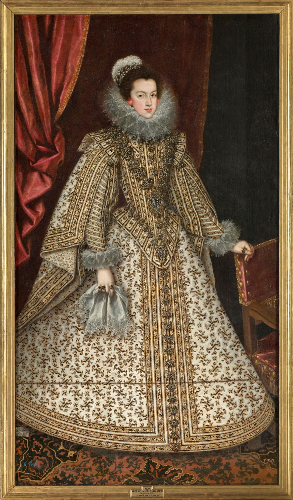

Gemalt von Rodrigo de Villandrando

circa 1620

Maße: 201 cm x 115 cm

heute hängt es im Museo del Prado

---

## Entstehung des Bildes

### Rodrigo de Villandrando
geboren in Madrid 1588
gestorben in Madrid 1622

Titel des ,,Gerichtsvollzieher”

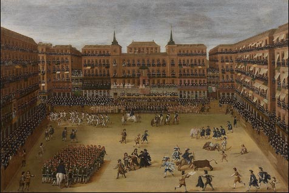

Er war Maler des Spanischen Hofs von 1608 bis 1622.

---

## Die Mode en detail

The *Syllabus Site* template can be easily used with minimal technical requirements.

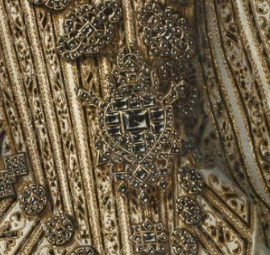

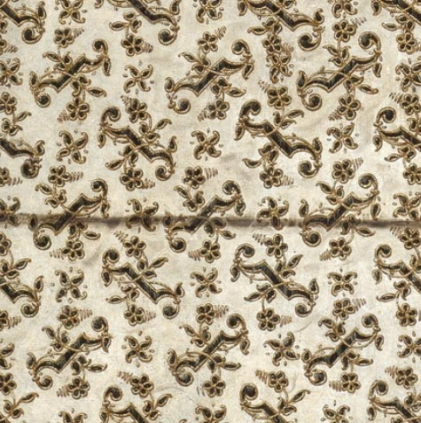

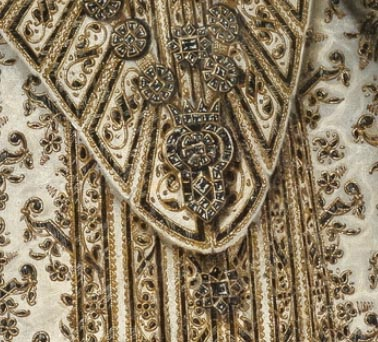

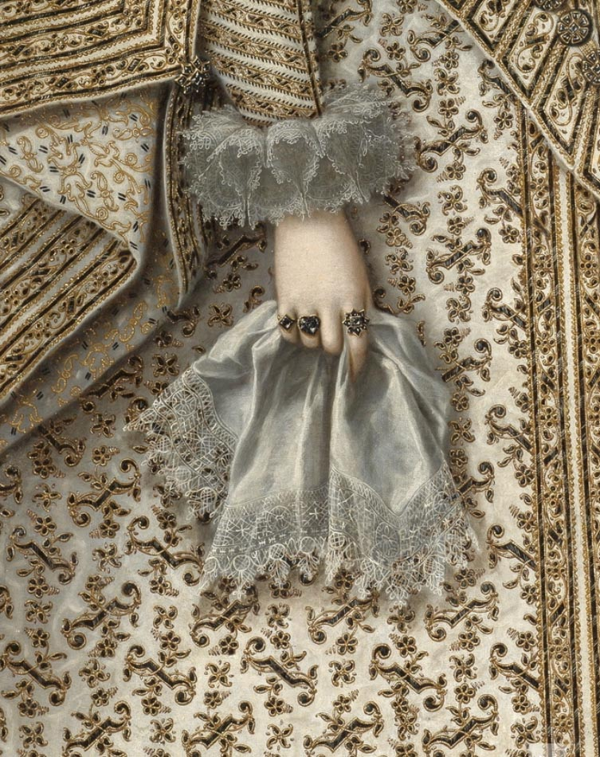

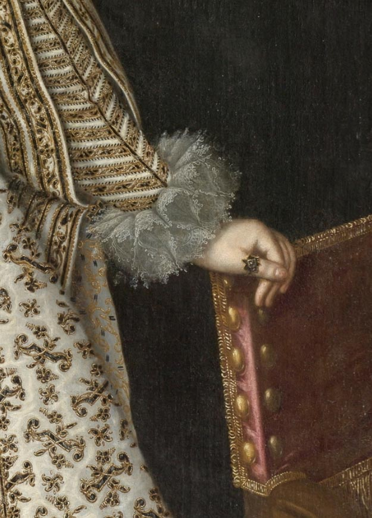

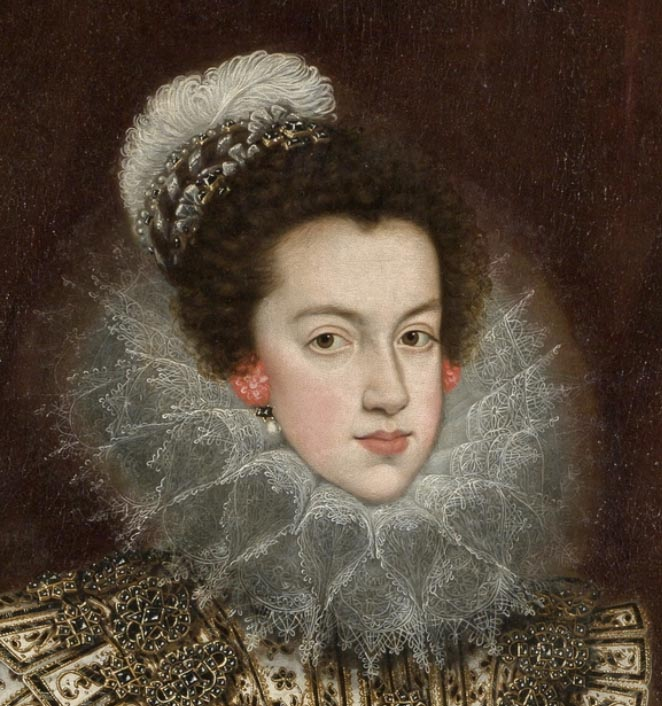

---

## Halskrause
Isabel de Borbon trägt eine Halskrause aus Spitze mit Floralen Details

Krausen aus Spitze wurden 1623 verboten, durch ein Luxusgesetz. Darauf folgten die Golilla Kragen, gehärtete Kragen die mehrmals getragen werden konnten.

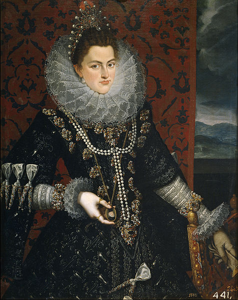
Isabel Clara Eugenia
Juan Pantoja de la Cruz
(1553–1608)

 Juan Pantoja de la Cruz (Spanish, 1553-1608). Doña Ana de Velasco y Girón, 1603. Collection of Alicia Koplowitz

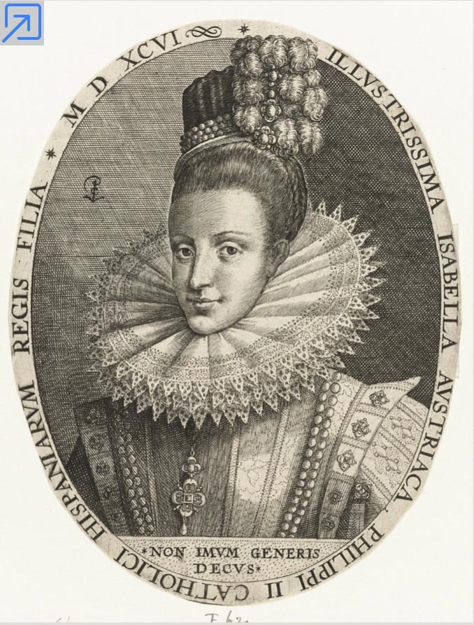
Busteportret van Isabella Clara Eugenia, Crispijn van de Passe (I), 1596
gravure, h 147mm × b 114mm

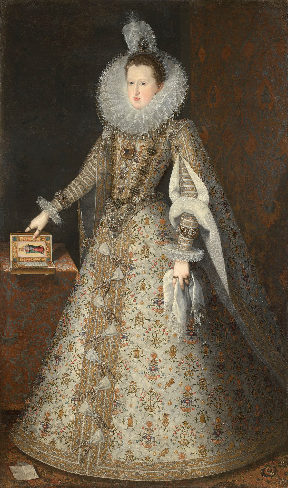
JUAN PANTOJA DE LA CRUZ (C. 1553-1608)
Margaret of Austria, Queen Consort of Philip III of Spain (1584-1611) c.1605
Oil on canvas | 204.6 x 121.2 cm | RCIN 404970

---

## Taschentuch und Manschette

### Manschette

Die Manschette war und ist häufig eine Art Gegenstück zum Kragen. Sie ergänzen sich oft in Stil und Form oder stehen in einem gewissen Verhältnis zueinander.

manchette ‚Ärmelchen

### Spitze

Spitze >Garngeflecht< bzw.
>in Zacken auslaufende Borte<
Diese Spitzenform wurde zuerst in Venedig gepflegt (Point de Venise) und bald in Frankreich nachgeahmt (Point de France, Point de Neige, Rose Point)

---

# Women’s Fashions and Politics in Seventeenth-Century Spain: The Rise and Fall of the Guardainfante
Author: Amanda Wunder

---

# Guardainfanta
Die größte Machtdemonstration nach außen ist das Kleid von Isabel de Borbòn
Es handelt sich um ein sogenanntes Guardainfanta.

### Design

The webpage is designed with the aim to open an evocative information space, where the sources that foster creativity, dialogue, and learning can be gathered, recapitulated, and appreciated. The monolithic structure of conventional documents is broken up, by introducing a relational quality to the connections between sections and items.

### Structure

There are two main types of elements:

- **Sections** – Larger blocks gather the material for weekly course sessions.
- **Items** – Smaller elements feature images, text, and other content.

Each item is connected with its section by a thin line. The navigation (≡) gives access to all sections.

The last section acts as the footer, where the typical array of logos and links belongs.

### Examples

The template is in use to document the following [Interface Design](https://interface.fh-potsdam.de) courses offered at [FH Potsdam](https://www.fh-potsdam.de/):

- **[Decolonizing Data Visualization – Visualizing Postcolonies](https://infovis.fh-potsdam.de/decolonizing/)** (Summer 2022)
- **[Organigrams for/from the future](https://infovis.fh-potsdam.de/organigrams/)** (Summer 2023)

[Decolonizing Data Visualization – Visualizing Postcolonies](https://infovis.fh-potsdam.de/decolonizing/)

[Organigrams for/from the future](https://infovis.fh-potsdam.de/organigrams/)

---

## How

The *Syllabus Site* template can be easily used with minimal technical requirements.

  
Page content and source side by side

### Get started

1. Download or clone the [GitHub repository](https://github.com/uclab-potsdam/syllabus-site/)
2. Give your page a title, fill out open graph fields, and adjust theme color in `index.html`
3. Add your content into `README.md` and `img/`

### Files

The template has the following file structure:

      img/
      index.html
      src/
      README.md

The `README.md` file contains all the textual content of your page and references the images that you need to add to the `img/` directory. 

The `index.html` file connects template and your content; here you need to make a few edits to add title, description, and preview of your webpage. 

You do not need to change anything within `src/`, which contains the internal files of the template.

### Syntax

The `README.md` uses the [Markdown](https://en.wikipedia.org/wiki/Markdown) format, a markup language used by many platforms including GitHub.

There are two conventions we introduce to distinguish and connect sections and items:

- **Sections** are delineated by a horizontal rule `---` 
- **Items** are separated by two empty consecutive lines

Each section should contain a heading:
`#` for primary, `##` for secondary, and so on.

### Things to consider

---

## Who

---

 
 

[Contact](mailto:marian.doerk@fh-potsdam.de,philipp.proff@gmx.de?subject=Syllabus%20Site) · [Imprint](https://www.fh-potsdam.de/impressum) · *This is a [Syllabus Site](https://infovis.fh-potsdam.de/syllabus-site/)*
